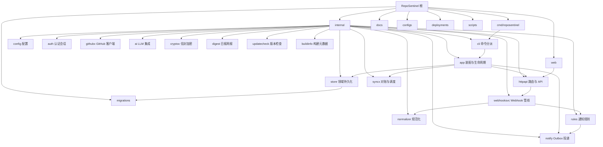

# CLAUDE.md

## 变更记录 (Changelog)

| 时间戳 (UTC) | 变更摘要 |
|---|---|
| 2026-08-12T13:30:00Z | ①AI 实时链路超时强制遵循配置：删除分诊/release 总结 15s 硬编码预算（改为按 `ai.Client.EffectiveTimeout` 建预算）、共享 HTTP 客户端 30s 硬顶移除（超时统一由 ctx 承载）、webhook 单条处理预算随 AI 超时放宽（下限 60s），「设置了超时却被更早截断」不再发生，超时后通知以原文链接兜底；②Release AI 总结提示词改「每行一条要点、`- ` 前缀」，推送正文告别整段长文字；③设置页数字输入统一为「自由输入、失焦钳制」（新增 NumberField 组件），修复输出 token 上限逐位输入首位数即被钳到 100，同步核查并迁移聚合窗口/保留天数/追踪上限等全部数字输入 |
| 2026-08-11T12:00:00Z | ①前端状态卡死修复：仓库彻底删除失败补 onSettled/onError（不再卡「删除中」）、Star 追踪行 busy 改为父级 mutation 判定、设置页表单仅首次加载回填（跨区块保存不再静默覆盖未保存编辑）；②可访问性：IgnoreToggle 补 aria-pressed、移动端/投递详情抽屉补焦点循环与模态语义、移动端主题下拉从 Tab 序移除、补 state-action_required/skipped 与 kind-release/star/watch 徽章；③通知文案收敛：digest 复用 store.KindDisplayName 与 rules.EventStatusLabel（消除映射漂移）、聚合标题「（已合并）」改「（已聚合）」、空摘要 🎉 改 📭、updatecheck 补句号；④日志留痕：webhook MarkProcessed/仓库生命周期/star 游标吞错补 Warn/Debug、投递失败日志补 error_code、AI 日志 URL 打码防内嵌凭据泄漏；⑤性能：star 同步与 outbox 投递渠道查询去 N+1、webhook 单条处理加 60s 超时、StarTrendChart memo、dead 总数查询条件化；⑥体验：仪表盘/outbox 重试失败反馈、outbox/star 追踪筛选同步 URL、复制反馈抽 useCopyFeedback、toApiError 重复解析收敛为 ApiErrorAlert；⑦错误处理：github_app_not_configured 统一 sentinel、MCP 错误不透出内部细节、updatecheck 未分类错误统一文案、unknown_channel 等确定性错误直判死信、Store 未装配返回 service_unavailable 语义码；⑧代码质量：rules 展示映射收敛到 display.go、GitHub 查看按钮文案抽常量、buildDigestBody 清理、Retry-After 硬编码抽常量、清除筛选按钮抽组件、筛选选中态两套样式统一、state 徽章令牌化（含深色档）、主题色改为运行时读设计令牌 |
| 2026-08-11T00:00:00Z | ①Star 增长曲线 Y 轴自适应缩放：不再从 0 起，围绕数据波动范围外扩（波动大贴近上下 100、个位波动自动收紧窗口），大基数下个位增长可见；②关于页移除 Git SHA 复制按钮（直接展示文本）、构建时间恢复绝对日期显示（不再显示「X 天前」） |
| 2026-08-10T13:00:00Z | Star 仓库 Release 追踪与通知：设置页填 GitHub 用户名匿名枚举公开 star 仓库（自动过滤 fork/archived、无 Release 仓 7 天复查），复用 GitHub App installation token + ETag 条件请求轮询各仓最新 Release，新版本实时通知并附 AI 中文总结（英文 notes 翻译摘要，失败原文链接兜底）；新增 release 事件类型与 `feature.starred_releases` 三层开关、双周期可配置（Star 同步 6h / Release 轮询 10m）、500 追踪上限、unstar 自动停用；代理经 `HTTPS_PROXY` 环境变量天然支持 |
| 2026-08-09T18:00:00Z | 第九轮（81-90）：①列表底部回到顶部；②对账/外部轮询单仓成功 Debug 留痕；③登录成功日志补 UA；④⑤⑥筛选按钮 aria-pressed（列表/outbox/仓库归档）；⑦仓库生命周期事件 Info 留痕；⑧JSON 413 响应带说明；⑨dashboard 错误码 hover 中文说明；⑩dashboard 事件打开 title |
| 2026-08-09T19:00:00Z | 第十轮（91-100）：①webhook 标记失败 Warn 留痕；②列表 GitHub 链接 title；③digest 无渠道 Debug 留痕；④对账按钮 aria-busy；⑤outbox 抽屉关联链接 title；⑥about 外链 title 统一；⑦GitHub 出站 UA；⑧文档同步；⑨全量验证；⑩提交 |
| 2026-08-09T14:00:00Z | 第八轮优化：①Star 图表深色主题适配（Tooltip/刻度随设计令牌）；②全局滚动条深色适配；③about 构建时间相对时间展示；④metrics 补 outbox pending/sending 队列深度；⑤FAQ 补通知排查条目 |
| 2026-08-09T10:00:00Z | 第七轮优化：①通知决策跳过留痕（suppressed/capability_off/not_realtime）；②聚合器超频降级 Warn + 合并 flush Debug 留痕；③webhook 成功日志补 event_id；④outbox 详情展示纯文本正文；⑤渠道行复制目标；⑥version 输出补 repository |
| 2026-08-09T06:00:00Z | 第六轮优化：①通知渠道目标失焦即时校验（Chat ID/HTTPS URL）；②登录限流后禁用提交；③session 清理 Debug 留痕；④事件去重 Debug 留痕（预查命中+索引冲突）；⑤installation removed 消费留痕；⑥对账按钮无自有仓禁用；⑦outbox 抽屉复制投递 ID |
| 2026-08-09T03:30:00Z | 修复：①去除侧边栏左下角版本号；②修复仪表盘可无限向下滚动（sr-only 绝对定位元素逃逸 .app-shell 的 overflow 裁剪撑出文档滚动，为外壳补 position: relative 建立定位上下文） |
| 2026-08-08T23:00:00Z | 仓库入口：登录/初始化页右上角与顶栏 GitHub 图标直达源码（内联 octocat SVG 补 lucide 缺的品牌图标）、关于页补「GitHub 仓库」链接、/auth.md 补 GitHub 行 |
| 2026-08-08T22:00:00Z | 第五轮优化：①HTTPS 部署下发 HSTS、CSP 补 form-action/upgrade-insecure-requests；②healthcheck 输出 latency_ms；③列表翻页失败重试；④登录失败清空密码并聚焦；⑤HTTP webhook 出站补 User-Agent；⑥retention 无过期数据也 Debug 留痕；⑦设置页时区失焦即时校验 |
| 2026-08-08T20:00:00Z | 第四轮优化：①采集跳过留痕（normalizer 注入 Logger，跳过原因 feature_disabled/monitor_off/archived_or_unavailable/capability_off Debug 输出）；②updatecheck 各路径 Debug 留痕；③webhook 慢处理（>5s）Warn 留痕；④Star 图 tooltip 显示日增量；⑤列表空态内联「清除筛选」；⑥路由错误兜底加「返回仪表盘」；⑦outbox 重试全部加确认；⑧主题切换颜色过渡 |
| 2026-08-08T18:00:00Z | 第三轮优化：①测试通知正文带发送时刻；②登录失败日志补 username、CSRF 失败日志补来源（不含密码/令牌）；③webhook 成功日志补 stale_discarded/unhandled_action；④列表页「清除筛选」按钮；⑤仓库页归档视图 URL 同步；⑥outbox 状态筛选 URL 同步 + 仪表盘跳转直达；⑦关于页 Git SHA 复制；⑧登录页限流特殊文案；⑨修复 useUrlState 只写 URL 不更新状态的缺陷 |
| 2026-08-08T16:00:00Z | 第二轮优化：①列表页筛选同步到 URL（useUrlState hook）；②设置页成功提示 3s 自动消退；③登录页用户名自动聚焦；④outbox「重试全部失败」跨页收集重试；⑤webhook 失败计数指标；⑥workflow 结论中文标签收敛到 store（rules/digest 共用）；⑦调度器成功留痕 Debug 级；⑧outbox 单批领取 20→50；⑨webhook 未配置 503 补 Retry-After |
| 2026-08-08T14:30:00Z | 优化轮：①管理台按路由更新标签页标题（登录/初始化页独立标题）；②相对时间统一收敛为 RelativeTime 组件并 hover 显示绝对时间；③投递记录错误码中文排障提示（全选/清空订阅类型快捷操作）；④webhook 拒绝日志补 delivery_id/event_type；⑤日/周/月报告补「生成时间」页脚（UTC 与规则通知一致）；⑥webhook 后台处理信号量限流（32 并发，关闭期间不排队）；⑦重复投递响应/日志收敛为单一函数 |
| 2026-08-08T09:01:00Z | 细节优化十项：①panic 恢复日志补 panic 值与调用堆栈；②outbox 领取失败日志补错误详情；③Telegram/HTTP 投递 4xx/5xx 截断响应体入错误，last_error_code 语义化（如 http_webhook_status_503）；④日报/周报/月报预览行带仓库名；⑤聚合消息补批次时间，超频摘要带事件跳转按钮；⑥功能开关守卫查询失败展示错误态；⑦仪表盘事件面板补分类快捷入口（随功能开关过滤）；⑧移动端顶栏标题函数导出并锁定单测；⑨投递成功日志补 attempt 计数、超长标题截断；⑩相关单测全部补齐 |
| 2026-08-08T06:00:00Z | 前端导航重组：侧边栏「关于与设置」拆分为「关于」/「设置」两页；仪表盘「仓库与基线对账」面板迁入设置页，对账与基线放行集中在 /settings 维护；相关文案与文档链接同步更新 |
| 2026-08-08T05:30:00Z | 仓库管理页新增「彻底删除」（DELETE /api/v1/repositories/{id} 级联清理），补上 repository.deleted webhook 漏投递时的手动收口 |
| 2026-08-07T12:00:00Z | 仓库生命周期收口：GitHub 侧删除（repository.deleted webhook）级联删除本地仓库与全部关联数据（PR/Issue、事件、告警、快照、游标、待投递通知）；对账遇 404/410 兜底标记 unavailable；解析 installation_repositories 的 repositories_removed 并标记 unavailable |
| 2026-08-07T10:00:00Z | 打磨：CSP 兼容修复（主题预置脚本外置、空态操作行内联样式改 CSS 类）、相对时间未来时间/月年粒度、Telegram 超长消息安全截断、SPA 静态资源 gzip、访问日志补 user_agent、webhook 错误日志补仓库名、加载更多按钮 aria-busy |
| 2026-08-06T15:48:41Z | 新增 GitHub star/watch 事件支持：实时通知判定与中文文案、三层开关（全局 feature 开关 / 仓库级 stars_enabled、watches_enabled / 渠道订阅 event_kinds）、仪表盘 Star 增长曲线（/api/v1/stats/star-trend） |
| 2026-08-06T12:50:00Z | Agent 发现（AI Readiness）：动态 sitemap.xml 与 robots.txt（含 Content-Signals）、全局 Link 头、RFC 9727 API 目录、OpenAPI 3.1、OAuth 2.0 client-credentials 令牌端点（/oauth/token、/oauth/jwks）与 RFC 8414/9728 discovery 元数据、auth.md、MCP Streamable HTTP 网关（/mcp）与 Server Card、Agent Skills 索引、Accept: text/markdown 协商、WebMCP 前端接入；新增 `deployments/dnsaid/example.zone`（DNS-AID 示例记录） |
| 2026-08-05T09:57:59Z | AI 上下文初始化：补充项目愿景、架构总览、Mermaid 模块图、模块索引；校正前端路由路径与版本示例；保留迁移/Ent/提交/CI/安全等既有约定 |

## 项目愿景

RepoSentinel 是面向个人与小团队的 **自托管 GitHub 仓库值守平台**。  
通过 GitHub App Webhook 实时接收 Issue / PR / Actions / 安全告警，用 REST API 对账补漏，经规则引擎与 Outbox 将重要变化推送到 Telegram 或 HTTP Webhook；可选 AI 摘要与安全告警分诊。  

默认 SQLite、可选 PostgreSQL；单进程模块化单体，管理后台嵌入同一二进制，适合公网 VPS / 自建机房一键部署。

当前版本见根目录 `VERSION`（初始化时为 `0.3.8`）。

## 项目概览

RepoSentinel — 自托管 GitHub 仓库值守平台。Go 后端 + React 前端，Ent ORM + Atlas 迁移，SQLite 默认 / PostgreSQL 可选，Docker 单容器部署。

## 架构总览

```text
                    GitHub
       ┌──────────────┴──────────────┐
       │                             │
 GitHub App Webhook             GitHub REST API
 自有仓库实时事件          对账 / 外部仓扩展
       │                             ▲
       ▼                             │
┌────────────────────────────────────────────────────┐
│              HTTPS 反向代理（可选）                  │
└──────────────────────┬─────────────────────────────┘
                       ▼
┌────────────────────────────────────────────────────┐
│                RepoSentinel（单进程）                │
│ CLI → app 装配 → httpapi (chi)                      │
│ Webhook → webhooksvc → normalizer → rules/agg       │
│ notify Worker（Outbox）+ syncx Scheduler            │
│ REST API + 嵌入式 React 管理后台                    │
└──────────────────────┬─────────────────────────────┘
                       ▼
              SQLite 或 PostgreSQL
```

运行时后台任务（由 `internal/app.Run` 启动）：

- Session 清理（默认 15m）
- 历史保留清理（默认 24h）
- 通知 Outbox Worker（默认 5s tick）
- 调度器：对账 ~6h、外部仓轮询 ~10m、摘要/周报/月报 ~1h

## 模块结构图



## 模块索引

| 路径 | 职责 | 模块文档 |
|------|------|----------|
| `cmd/reposentinel` | 进程入口，委托 `internal/cli` | [cmd/CLAUDE.md](cmd/CLAUDE.md) |
| `internal` | 后端全部业务包（见子索引） | [internal/CLAUDE.md](internal/CLAUDE.md) |
| `internal/app` | 依赖装配、生命周期、后台任务 | [internal/app/CLAUDE.md](internal/app/CLAUDE.md) |
| `internal/cli` | serve/version/config/admin/doctor/healthcheck/backup/restore | [internal/cli/CLAUDE.md](internal/cli/CLAUDE.md) |
| `internal/config` | YAML + 环境变量加载与校验 | [internal/config/CLAUDE.md](internal/config/CLAUDE.md) |
| `internal/httpapi` | Chi 路由、REST API、中间件、SPA、Agent 发现端点 | [internal/httpapi/CLAUDE.md](internal/httpapi/CLAUDE.md) |
| `internal/store` | 领域模型、Store 接口、Ent 适配 | [internal/store/CLAUDE.md](internal/store/CLAUDE.md) |
| `internal/auth` | 管理员、密码、Session、CSRF、登录限流 | [internal/auth/CLAUDE.md](internal/auth/CLAUDE.md) |
| `internal/githubx` | App JWT、Webhook 验签、REST、运行时配置 | [internal/githubx/CLAUDE.md](internal/githubx/CLAUDE.md) |
| `internal/webhooksvc` | Webhook 业务管线编排 | [internal/webhooksvc/CLAUDE.md](internal/webhooksvc/CLAUDE.md) |
| `internal/normalizer` | 载荷规范化、指纹、乱序保护 | [internal/normalizer/CLAUDE.md](internal/normalizer/CLAUDE.md) |
| `internal/rules` | 实时通知规则与短时聚合 | [internal/rules/CLAUDE.md](internal/rules/CLAUDE.md) |
| `internal/notify` | Outbox 领取、Telegram/HTTP 投递 | [internal/notify/CLAUDE.md](internal/notify/CLAUDE.md) |
| `internal/syncx` | 安装仓对账、外部仓轮询、调度 | [internal/syncx/CLAUDE.md](internal/syncx/CLAUDE.md) |
| `internal/ai` | OpenAI 兼容客户端、摘要与分诊 | [internal/ai/CLAUDE.md](internal/ai/CLAUDE.md) |
| `web` | React 管理台 + Go embed | [web/CLAUDE.md](web/CLAUDE.md) |
| `migrations` | Atlas 双轨 SQL 迁移嵌入 | [migrations/CLAUDE.md](migrations/CLAUDE.md) |
| `docs` | VitePress 用户/运维/架构文档 | [docs/CLAUDE.md](docs/CLAUDE.md) |
| `configs` | 示例 YAML 配置 | [configs/CLAUDE.md](configs/CLAUDE.md) |
| `deployments` | 测试用 Compose 等 | [deployments/CLAUDE.md](deployments/CLAUDE.md) |
| `scripts` | 文档站资源准备脚本 | [scripts/CLAUDE.md](scripts/CLAUDE.md) |

较小支撑包（文档并入 `internal/CLAUDE.md`）：`cryptox`、`digest`、`buildinfo`、`updatecheck`。

## 技术栈

| 层 | 技术 |
|---|------|
| 后端 | Go 1.26+，Chi 路由，Ent ORM，Atlas 迁移 |
| 前端 | React 19，TanStack Router/Query，Vite，pnpm 10.34.5，TypeScript |
| 数据库 | SQLite（默认）+ PostgreSQL（可选），双轨迁移 |
| 部署 | Docker / GHCR，CI 由 Tag `v*` 或 main/dev 推送触发 |
| 文档站 | VitePress（根 `package.json`） |

## 开发命令

```bash
# 后端
go test ./...
go vet ./...
make build                    # 本地构建
make build-production         # 嵌入前端的生产构建（-tags production）

# 前端
pnpm --dir web install
pnpm --dir web typecheck      # 必须通过
pnpm --dir web test -- --run
pnpm --dir web build
# 可选 e2e：pnpm --dir web e2e

# 文档站
npm run docs:dev
npm run docs:build

# 综合验证
make verify                   # fmt + test + vet + build + test-frontend
```

## 提交规范

格式：`<emoji> <type>: <中文描述>`

| Emoji | 类型 | 说明 |
|-------|------|------|
| ✨ | feat | 新功能 |
| 🔧 / 🐛 | fix | 修复 |
| 🎨 | fix | UI/样式修复 |
| 📝 | docs | 文档 |

- 描述使用简体中文
- 禁止出现 `Co-Authored-By: Claude` 等 AI 生成标识
- 一个提交解决一个问题，不做无关改动

## 文档与提交措辞（强制）

- 变更记录（本文件变更记录表、`CHANGELOG.md`、`docs/`）与提交信息中，禁止出现「打磨」「全项目」「迭代」「第 X 轮 / N 轮」「批次」等描述执行过程或轮次的字眼。
- 变更记录只直述改动内容、原因与影响，不描述「做了几轮、怎么打磨」等过程信息；提交描述同理。

## 数据库迁移（重要）

修改 Ent schema 后必须执行完整迁移流程：

```bash
# 1. 修改 schema 文件（internal/store/ent/schema/*.go）

# 2. 重新生成 Ent 代码
go generate ./internal/store/ent/...

# 3. 创建 Atlas 迁移（SQLite + PostgreSQL 各一份）
#    文件名格式：migrations/{sqlite,postgres}/YYYYMMDDHHMMSS_description.sql

# 4. 重算 atlas.sum 校验和（必须，否则 CI 失败）
go generate ./migrations/...

# 5. 验证迁移
go test ./migrations/...
```

注意事项：
- SQLite 和 PostgreSQL 迁移文件必须同步创建（部分仅 PG 需要的变更如 `bigint`/`jsonb` 可仅出现在 postgres 目录，但语义需一致）
- PostgreSQL 的 `integer`（int4）最大值 2,147,483,647；GitHub ID 已超过此值，相关字段必须用 `bigint`
- Ent 的 `field.Int64` 在 PostgreSQL 需要 `bigint` 迁移，不是 `integer`
- `atlas.sum` 校验和必须用 `go generate ./migrations/...` 重算，不可手写
- 迁移文件为不可变：已提交的迁移不要修改，只新增

## Ent ORM 约定

- Schema 定义在 `internal/store/ent/schema/`，修改后必须 `go generate`
- 领域模型在 `internal/store/domain.go`，Store 接口在同一文件（管理员/会话等亦见 `store.go`）
- 实现在 `internal/store/domain_stores.go` 及 `*_store.go`
- 物理表名通过 `entsql.Annotation{Table: "..."}` 固定，与 Atlas 迁移一致
- 新增字段需同步更新：schema → domain 模型 → store 实现 → fromEntity 映射

## 前端约定

- 路由：TanStack Router，路由树定义在 `web/src/app/router.tsx`（非 `web/src/routes/`）
- 数据获取：TanStack Query，`queryOptions` 模式
- API 客户端：`web/src/lib/api/client.ts`
- 类型与监控 API：`web/src/features/monitor/api.ts` 导出共享类型
- 认证 API：`web/src/features/auth/api.ts`
- 工具函数：`web/src/lib/format.ts`（如 formatRelativeTime）
- 侧边栏与壳层：`web/src/app/root-layout.tsx`
- 样式：`web/src/styles/globals.css` + `tokens.css`（产品样式以设计令牌为主；构建链含 Tailwind 4 插件）

## CI/CD 发布流程

项目使用 **Tag 触发 CI 发布**：

```bash
# 1. 确保 VERSION 文件、CHANGELOG.md、README.md 版本号一致

# 2. 提交发布改动
git commit -m "✨ feat: ..."

# 3. 创建 annotated Tag（版本与 VERSION 一致，例如 0.3.8）
git tag -a v0.3.8 -m "v0.3.8"

# 4. 推送分支和 Tag
git push origin main
git push origin v0.3.8
```

CI 自动执行：test → build-and-push（v* Tag 触发双架构 amd64+arm64）→ 推送 GHCR

镜像标签规则：
- `v*` Tag → `vX.Y.Z` + `latest`
- `main` 分支 → `main` + `main-<sha>`
- `dev` 分支 → `dev` + `dev-<sha>`

## 版本号

- 位置：根目录 `VERSION` 文件（如 `0.3.8`）
- 遵循 SemVer
- 发布时需同步更新：`VERSION`、`CHANGELOG.md`、`README.md` 徽章
- 二进制通过 `Makefile` ldflags 注入 `internal/buildinfo`

## 安全注意

- 不在代码或提交中暴露密钥、Token、Secret
- 敏感配置通过环境变量或主密钥 AES-GCM 加密（`cryptox`）
- Webhook 验签使用 HMAC-SHA256（`githubx`）
- Session 使用 HttpOnly Cookie + 双提交 CSRF
- 单管理员模型；登录限流；首次 setup 默认仅 loopback（`setup.allow_remote`）

## 关键路径速查

| 用途 | 路径 |
|------|------|
| 进程入口 | `cmd/reposentinel/main.go` |
| 装配 | `internal/app/bootstrap.go` |
| 生命周期 | `internal/app/run.go` |
| HTTP 路由 | `internal/httpapi/server.go` |
| 领域模型 | `internal/store/domain.go` |
| Ent schema | `internal/store/ent/schema/` |
| 示例配置 | `configs/reposentinel.example.yaml` |
| 架构说明 | `docs/reference/architecture.md` |
