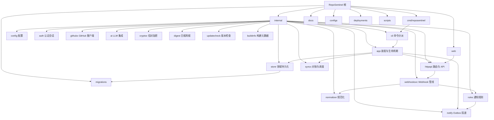

# CLAUDE.md

## 变更记录 (Changelog)

| 时间戳 (UTC) | 变更摘要 |
|---|---|
| 2026-08-05T09:57:59Z | AI 上下文初始化：补充项目愿景、架构总览、Mermaid 模块图、模块索引；校正前端路由路径与版本示例；保留迁移/Ent/提交/CI/安全等既有约定 |

## 项目愿景

RepoSentinel 是面向个人与小团队的 **自托管 GitHub 仓库值守平台**。  
通过 GitHub App Webhook 实时接收 Issue / PR / Actions / 安全告警，用 REST API 对账补漏，经规则引擎与 Outbox 将重要变化推送到 Telegram 或 HTTP Webhook；可选 AI 摘要与安全告警分诊。  

默认 SQLite、可选 PostgreSQL；单进程模块化单体，管理后台嵌入同一二进制，适合公网 VPS / 自建机房一键部署。

当前版本见根目录 `VERSION`（初始化时为 `0.3.8`）。

## 项目概览

RepoSentinel — 自托管 GitHub 仓库值守平台。Go 后端 + React 前端，Ent ORM + Atlas 迁移，SQLite 默认 / PostgreSQL 可选，Docker 单容器部署。

## 架构总览

```text
                    GitHub
       ┌──────────────┴──────────────┐
       │                             │
 GitHub App Webhook             GitHub REST API
 自有仓库实时事件          对账 / 外部仓扩展
       │                             ▲
       ▼                             │
┌────────────────────────────────────────────────────┐
│              HTTPS 反向代理（可选）                  │
└──────────────────────┬─────────────────────────────┘
                       ▼
┌────────────────────────────────────────────────────┐
│                RepoSentinel（单进程）                │
│ CLI → app 装配 → httpapi (chi)                      │
│ Webhook → webhooksvc → normalizer → rules/agg       │
│ notify Worker（Outbox）+ syncx Scheduler            │
│ REST API + 嵌入式 React 管理后台                    │
└──────────────────────┬─────────────────────────────┘
                       ▼
              SQLite 或 PostgreSQL
```

运行时后台任务（由 `internal/app.Run` 启动）：

- Session 清理（默认 15m）
- 历史保留清理（默认 24h）
- 通知 Outbox Worker（默认 5s tick）
- 调度器：对账 ~6h、外部仓轮询 ~10m、摘要/周报/月报 ~1h

## 模块结构图



## 模块索引

| 路径 | 职责 | 模块文档 |
|------|------|----------|
| `cmd/reposentinel` | 进程入口，委托 `internal/cli` | [cmd/CLAUDE.md](cmd/CLAUDE.md) |
| `internal` | 后端全部业务包（见子索引） | [internal/CLAUDE.md](internal/CLAUDE.md) |
| `internal/app` | 依赖装配、生命周期、后台任务 | [internal/app/CLAUDE.md](internal/app/CLAUDE.md) |
| `internal/cli` | serve/version/config/admin/doctor/healthcheck/backup/restore | [internal/cli/CLAUDE.md](internal/cli/CLAUDE.md) |
| `internal/config` | YAML + 环境变量加载与校验 | [internal/config/CLAUDE.md](internal/config/CLAUDE.md) |
| `internal/httpapi` | Chi 路由、REST API、中间件、SPA | [internal/httpapi/CLAUDE.md](internal/httpapi/CLAUDE.md) |
| `internal/store` | 领域模型、Store 接口、Ent 适配 | [internal/store/CLAUDE.md](internal/store/CLAUDE.md) |
| `internal/auth` | 管理员、密码、Session、CSRF、登录限流 | [internal/auth/CLAUDE.md](internal/auth/CLAUDE.md) |
| `internal/githubx` | App JWT、Webhook 验签、REST、运行时配置 | [internal/githubx/CLAUDE.md](internal/githubx/CLAUDE.md) |
| `internal/webhooksvc` | Webhook 业务管线编排 | [internal/webhooksvc/CLAUDE.md](internal/webhooksvc/CLAUDE.md) |
| `internal/normalizer` | 载荷规范化、指纹、乱序保护 | [internal/normalizer/CLAUDE.md](internal/normalizer/CLAUDE.md) |
| `internal/rules` | 实时通知规则与短时聚合 | [internal/rules/CLAUDE.md](internal/rules/CLAUDE.md) |
| `internal/notify` | Outbox 领取、Telegram/HTTP 投递 | [internal/notify/CLAUDE.md](internal/notify/CLAUDE.md) |
| `internal/syncx` | 安装仓对账、外部仓轮询、调度 | [internal/syncx/CLAUDE.md](internal/syncx/CLAUDE.md) |
| `internal/ai` | OpenAI 兼容客户端、摘要与分诊 | [internal/ai/CLAUDE.md](internal/ai/CLAUDE.md) |
| `web` | React 管理台 + Go embed | [web/CLAUDE.md](web/CLAUDE.md) |
| `migrations` | Atlas 双轨 SQL 迁移嵌入 | [migrations/CLAUDE.md](migrations/CLAUDE.md) |
| `docs` | VitePress 用户/运维/架构文档 | [docs/CLAUDE.md](docs/CLAUDE.md) |
| `configs` | 示例 YAML 配置 | [configs/CLAUDE.md](configs/CLAUDE.md) |
| `deployments` | 测试用 Compose 等 | [deployments/CLAUDE.md](deployments/CLAUDE.md) |
| `scripts` | 文档站资源准备脚本 | [scripts/CLAUDE.md](scripts/CLAUDE.md) |

较小支撑包（文档并入 `internal/CLAUDE.md`）：`cryptox`、`digest`、`buildinfo`、`updatecheck`。

## 技术栈

| 层 | 技术 |
|---|------|
| 后端 | Go 1.26+，Chi 路由，Ent ORM，Atlas 迁移 |
| 前端 | React 19，TanStack Router/Query，Vite，pnpm 10.34.5，TypeScript |
| 数据库 | SQLite（默认）+ PostgreSQL（可选），双轨迁移 |
| 部署 | Docker / GHCR，CI 由 Tag `v*` 或 main/dev 推送触发 |
| 文档站 | VitePress（根 `package.json`） |

## 开发命令

```bash
# 后端
go test ./...
go vet ./...
make build                    # 本地构建
make build-production         # 嵌入前端的生产构建（-tags production）

# 前端
pnpm --dir web install
pnpm --dir web typecheck      # 必须通过
pnpm --dir web test -- --run
pnpm --dir web build
# 可选 e2e：pnpm --dir web e2e

# 文档站
npm run docs:dev
npm run docs:build

# 综合验证
make verify                   # fmt + test + vet + build + test-frontend
```

## 提交规范

格式：`<emoji> <type>: <中文描述>`

| Emoji | 类型 | 说明 |
|-------|------|------|
| ✨ | feat | 新功能 |
| 🔧 / 🐛 | fix | 修复 |
| 🎨 | fix | UI/样式修复 |
| 📝 | docs | 文档 |

- 描述使用简体中文
- 禁止出现 `Co-Authored-By: Claude` 等 AI 生成标识
- 一个提交解决一个问题，不做无关改动

## 数据库迁移（重要）

修改 Ent schema 后必须执行完整迁移流程：

```bash
# 1. 修改 schema 文件（internal/store/ent/schema/*.go）

# 2. 重新生成 Ent 代码
go generate ./internal/store/ent/...

# 3. 创建 Atlas 迁移（SQLite + PostgreSQL 各一份）
#    文件名格式：migrations/{sqlite,postgres}/YYYYMMDDHHMMSS_description.sql

# 4. 重算 atlas.sum 校验和（必须，否则 CI 失败）
go generate ./migrations/...

# 5. 验证迁移
go test ./migrations/...
```

注意事项：
- SQLite 和 PostgreSQL 迁移文件必须同步创建（部分仅 PG 需要的变更如 `bigint`/`jsonb` 可仅出现在 postgres 目录，但语义需一致）
- PostgreSQL 的 `integer`（int4）最大值 2,147,483,647；GitHub ID 已超过此值，相关字段必须用 `bigint`
- Ent 的 `field.Int64` 在 PostgreSQL 需要 `bigint` 迁移，不是 `integer`
- `atlas.sum` 校验和必须用 `go generate ./migrations/...` 重算，不可手写
- 迁移文件为不可变：已提交的迁移不要修改，只新增

## Ent ORM 约定

- Schema 定义在 `internal/store/ent/schema/`，修改后必须 `go generate`
- 领域模型在 `internal/store/domain.go`，Store 接口在同一文件（管理员/会话等亦见 `store.go`）
- 实现在 `internal/store/domain_stores.go` 及 `*_store.go`
- 物理表名通过 `entsql.Annotation{Table: "..."}` 固定，与 Atlas 迁移一致
- 新增字段需同步更新：schema → domain 模型 → store 实现 → fromEntity 映射

## 前端约定

- 路由：TanStack Router，路由树定义在 `web/src/app/router.tsx`（非 `web/src/routes/`）
- 数据获取：TanStack Query，`queryOptions` 模式
- API 客户端：`web/src/lib/api/client.ts`
- 类型与监控 API：`web/src/features/monitor/api.ts` 导出共享类型
- 认证 API：`web/src/features/auth/api.ts`
- 工具函数：`web/src/lib/format.ts`（如 formatRelativeTime）
- 侧边栏与壳层：`web/src/app/root-layout.tsx`
- 样式：`web/src/styles/globals.css` + `tokens.css`（产品样式以设计令牌为主；构建链含 Tailwind 4 插件）

## CI/CD 发布流程

项目使用 **Tag 触发 CI 发布**：

```bash
# 1. 确保 VERSION 文件、CHANGELOG.md、README.md 版本号一致

# 2. 提交发布改动
git commit -m "✨ feat: ..."

# 3. 创建 annotated Tag（版本与 VERSION 一致，例如 0.3.8）
git tag -a v0.3.8 -m "v0.3.8"

# 4. 推送分支和 Tag
git push origin main
git push origin v0.3.8
```

CI 自动执行：test → build-and-push（v* Tag 触发双架构 amd64+arm64）→ 推送 GHCR

镜像标签规则：
- `v*` Tag → `vX.Y.Z` + `latest`
- `main` 分支 → `main` + `main-<sha>`
- `dev` 分支 → `dev` + `dev-<sha>`

## 版本号

- 位置：根目录 `VERSION` 文件（如 `0.3.8`）
- 遵循 SemVer
- 发布时需同步更新：`VERSION`、`CHANGELOG.md`、`README.md` 徽章
- 二进制通过 `Makefile` ldflags 注入 `internal/buildinfo`

## 安全注意

- 不在代码或提交中暴露密钥、Token、Secret
- 敏感配置通过环境变量或主密钥 AES-GCM 加密（`cryptox`）
- Webhook 验签使用 HMAC-SHA256（`githubx`）
- Session 使用 HttpOnly Cookie + 双提交 CSRF
- 单管理员模型；登录限流；首次 setup 默认仅 loopback（`setup.allow_remote`）

## 关键路径速查

| 用途 | 路径 |
|------|------|
| 进程入口 | `cmd/reposentinel/main.go` |
| 装配 | `internal/app/bootstrap.go` |
| 生命周期 | `internal/app/run.go` |
| HTTP 路由 | `internal/httpapi/server.go` |
| 领域模型 | `internal/store/domain.go` |
| Ent schema | `internal/store/ent/schema/` |
| 示例配置 | `configs/reposentinel.example.yaml` |
| 架构说明 | `docs/reference/architecture.md` |
