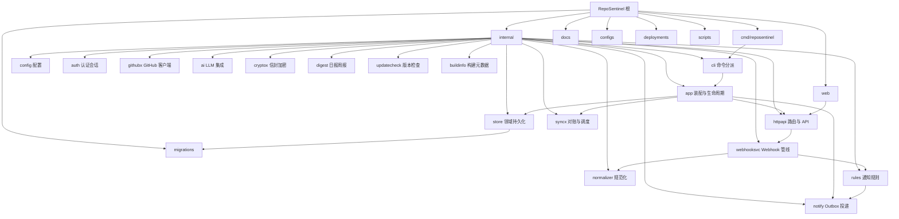

# CLAUDE.md

## 变更记录 (Changelog)

| 时间戳 (UTC) | 变更摘要 |
|---|---|
| 2026-09-03T21:55:00Z | ①仓库激活与配置更新端点补充 id 参数去空与非空校验；②Star 追踪器状态切换端点补充 tracker id 参数去空与非空校验；③统一空标识统一返回 400 validation_failed |
| 2026-09-03T21:45:00Z | ①初始化端点增加用户名与初始密码去空非空校验；②补充初始化端点拒绝空白凭据测试用例；③智能值守端点密钥与模型参数去空校验防守 |
| 2026-09-03T21:35:00Z | ①修改密码端点增加当前密码与新密码去空非空校验；②前端修改密码表单增加当前密码空值即时拦截；③补充修改密码端点拒绝全空白当前密码与新密码测试用例 |
| 2026-09-03T21:25:00Z | ①GitHub 配置更新端点对空白 Webhook 密钥与私钥校验拦截；②前端配置表单对 Client ID 与 Public Base URL 进行去空清洗；③补充空白密钥与空白私钥参数拒绝测试用例 |
| 2026-09-03T21:15:00Z | ①外部公开仓 PollAll 循环补充 ctx.Err 取消检查；②Star 列表分页获取补充上下文取消感知；③Release 追踪器候选遍历补充 ctx.Err 熔断；④保障外部轮询与追踪器在服务停机时立即响应 |
| 2026-09-03T21:05:00Z | ①出站 Webhook URL 校验前首尾去空清洗；②前端通知渠道表单提交前对密钥去空；③补充包含前后空格及纯空格 Webhook URL 测试用例 |
| 2026-09-03T20:55:00Z | ①通知渠道名称、目标与密钥去空清洗；②订阅事件类型数组修剪去重与白名单校验；③通知渠道空名称安全回退；④投递重试端点空白标识符边界校验；⑤补充渠道配置清洗与重试校验测试用例 |
| 2026-09-03T20:45:00Z | ①登录页外部链接补齐 noopener 安全属性；②初始化页外链规范安全属性；③GitHub 配置引导页外链统一样式与属性；④事件列表与投递详情外链安全规范化；⑤仪表盘与设置页外部仓库链接安全防护 |
| 2026-09-03T20:35:00Z | ①CLI子命令通用支持 -c 配置简写；②备份与恢复增加 -o/-i 路径简写；③密码读取防护空输入流；④空状态组件增加无障碍地标标签；⑤错误提示组件默认标题与空描述防守 |
| 2026-09-03T20:25:00Z | ①聚合器补充 FlushAll 清空并提交方法；②读取数值设置空存储保护；③同步状态标签兼容空值输入；④投递状态标签兼容空值输入；⑤事件类型标签兼容空值输入 |
| 2026-09-03T20:15:00Z | ①时区与时间配置自动修剪首尾空白；②发送日英文周名修剪与大小写兼容；③追踪项非法发布时间安全回退；④追踪项外链规范安全属性；⑤运行偏好表单周名预清洗 |
| 2026-09-03T20:05:00Z | ①日志标题空白换行规范化；②HTML转纯文本单引号与标签属性兼容；③前端客户端Cookie空环境守卫；④重定向登录防守空历史栈；⑤无内容204状态透出返回 |
| 2026-09-03T19:55:00Z | ①配置驱动与地址空白兼容；②MCP工具调用参数健壮转换；③审计日志时间回退与空标识防护；④趋势图空日期安全守卫；⑤关于页外链安全性加固 |
| 2026-09-03T19:45:00Z | ①时序空值回退 UTC 时间；②重试退避解析防守空响应；③规则消息仓库与链接空白修剪；④REST 请求分页下限防护；⑤筛选按钮无障碍标签 |
| 2026-09-03T19:35:00Z | ①CLI 命令行版本别名与帮助引导；②工作流结论与事件动作映射扩充；③格式化辅助函数空安全回退；④通知订阅空值防守 |
| 2026-09-03T19:25:00Z | ①Webhook 载荷空值校验；②规则渲染 nil 安全回退；③用户名空白清洗；④存储层 ChannelIDs 过滤项清洗；⑤数字输入框边界验证 |
| 2026-09-03T19:18:00Z | ①通知死信判定收口 4xx 永久失败；②报告页脚零值时间保护；③仓库删除与列表查询上限边界加固；④图表坐标 NaN 安全回退 |
| 2026-09-03T19:10:00Z | ①useUrlState 增加 window/location 存在性保护防 SSR 崩溃；②OpenAPI 契约校准真实运维端点定义与断言；③全量测试通过 |
| 2026-09-03T19:05:00Z | ①decodeRequestJSON 在 JSON 语法不合法或请求体存在多余非空数据时透传明确细分原因，排查 API 传参更直观；②验证全量 httpapi 单元测试通过 |
| 2026-09-03T19:00:00Z | ①EventStatusLabel 与 statusDisplay 增加对 nil 事件的空指针安全回退（📌 有更新），消除格式化潜在 panic；②补充 display 单元测试覆盖 nil 边界；③全套规则引擎回归测试通过 |
| 2026-09-03T18:55:00Z | ①NormalizeListFilter 对字符串过滤参数（RepositoryID/Kind/State/Status/ReviewDecision/CheckStatus）执行首尾空白清洗，防 SQL 查询失配；②WebMCP 前端网关补充 list_events、get_star_trend、list_starred_releases 工具定义并断言；③全套单元测试与类型校验锁定 |
| 2026-09-03T18:50:00Z | ①扩展 MCP 工具集：新增 list_events、get_star_trend、list_starred_releases 工具，Outbox 支持状态与渠道类型过滤；②OpenAPI 规范补齐死信重试、仓库删除、基线与对账端点定义并断言；③JSON 请求解码对非 application/json 请求头提供明确 415 细分说明；④系统版本与构建信息接口增加 Cache-Control 标头避免过度缓存；⑤补齐 MCP 工具与 OpenAPI 架构回归测试 |
| 2026-08-27T15:30:00Z | ①AI 配置健壮性：库内 JSON 损坏/API Key 信封解密失败改报错（此前静默降级为「未配置」，已配置 AI 凭空消失无从排查）；②PR 审核一致性：最新评审非 APPROVED/CHANGES_REQUESTED 终态时清空 ReviewDecision（不再出现 COMMENTED+changes_requested 矛盾对）；webhook 标记失败 Warn 补 delivery_id/event_type；③ReconcileRepository 拆 resolveInstallationToken/syncStarSnapshot/finalizeSyncState 三子函数，MaxPages 惰性写改只读访问器（消数据竞争隐患），「github rate low」升 Warn 补 error_code，更新检查双路径失败改报权威 API 错误且 HTTP 客户端包级共享；④sqlite 显式配置连接池>1 启动直接拒绝（此前静默忽略），digest 事件量/预览条数提常量；⑤设置页 AI 表单回填补「仅首次」守卫（保存后 invalidate 不再覆盖他区未保存编辑）、派生数组 useMemo、仪表盘功能开关失败补错误条、FeatureGuard 透传功能描述；⑥文案与死代码：GitHub 页「立即放行」指引改指设置页、删除三组无引用死样式（Tailwind --color-* 别名/.onboarding-list/.form-grid--section 族）、追踪列表 per_page 提常量；⑦路由补 defaultPendingComponent（lazy chunk 首载不再空白）、WebMCP bfcache 恢复重新注册；vite 分包实验回退（rolldown 废弃 manualChunks/advancedChunks 且按其原生 codeSplitting 分组后 React 仍落入 recharts chunk 被登录页依赖，回退默认分包）、dev proxy 补 Agent 发现/OAuth 端点、Dockerfile 默认版本改 0.4.0；⑨文档同步：版本指南补公开 build-info 端点、列表 API 补 retry-dead、docs 资产脚本补两页、.env.example 补 Star/AI/OAuth 段；⑩CI 对齐：make test 带 -race、test job 追加 Playwright e2e 阶段、nomore-spam 钉 v4 补超时；⑪e2e：修复 auth.spec Tab 序陈旧断言（GitHub 链接加入后静默失效）、主题持久化改存储层断言（移动端控件有意隐藏）、ensureAuthenticated 会话按项目复用（登录限流 5 次突发+12s 补 1，每用例各登必 429）、新增 monitor.spec 覆盖设置 round-trip/仪表盘首屏/筛选清除链路（10/10 通过） |
| 2026-08-26T20:30:00Z | ①webhook 管线正确性：状态标记预算从「标记时刻」起算（超 5s 慢处理不再标记失败、残留 accepted 被重放）、watch/star 无时间戳载荷指纹改 deliveryID 幂等（accepted 重放不再重复事件）、star 计数快照写失败降级为 Warn 不再阻断事件落库；②Agent 发现目录同步：MCP list_repositories type 枚举改真实存储值（此前传值必查空）、security alerts state 放开自由透传、OpenAPI 补 /api/v1/system/build-info、SKILL.md 修正 type 取值并补四个端点；③MCP 网关：/mcp 补 Store 统一守卫、initialize 版本 dev 回退、协议版本头随协商回写；④HTTP 语义：全局 MethodNotAllowed 改 405、markdown 协商收紧到 SPA 规范路径（不存在路径不再 200 软着陆）、OAuth 限流错误码改 temporarily_unavailable；⑤JWKS 不再携带对称密钥材料（k 即签名密钥，公开即可自签令牌）；⑥Outbox 批量重试改后端单次 UPDATE：新增 POST /notifications/outbox/retry-dead，前端从跨页收集+逐条串行改单调用；⑦Outbox 领取改批量 UPDATE（51 次 SQL/tick → 2 次）、对账 PR 已查行透传 UpsertIfNewer 消二次 SELECT；⑧通知管线：聚合热加载不再把「键未设置」打假 Warn、flush 预算随 AI 配置超时放宽、webhook 归档联动写失败补 Warn；⑨CLI：healthcheck 失败带 URL 与原因、backup 输出 size_bytes/duration_ms、doctor 错误单行化、admin reset-password 输出 key=value、主密钥格式非法与库内不匹配分流（ErrInvalidEncryptionKey）；⑩发现资产与启动：Agent Link 头不再附加静态资产与 /metrics、发现文档 TTL 统一一档、readiness 移到 HTTP 监听成功后（消除假就绪窗口）、docs robots.txt 改脚本生成（Sitemap 绝对地址）且 llms.txt 补运行时 Agent 端点；⑪审查收口：对账 PR enrich 后不再复用 enrich 前旧行做新鲜度判定（防 webhook 并发写入被回滚）、单条 RetryDead 补 dead 状态守卫（在途投递不再被翻回 pending 重复投递）、密码重置密钥错误分流补齐、Outbox 计数与批量重试渠道口径一致、405 补 Allow 头、派生密钥未装配独立 sentinel ErrKeyUnavailable |
| 2026-08-26T15:30:00Z | ①AI 配置热更新丢失 ReleaseSummaryEnabled：Client.Replace 补拷贝该字段，管理台保存后即生效，补全字段替换回归测试；②同步链路日志收口：reconcile/external 单仓失败补 error 详情（此前仅 error_code）、unstar 候选查询失败 Warn 留痕、令牌告警按调用方区分 star sync / release poll 场景、installations Warn 统一 error_code、doctor 统计失败不再静默；③错误语义与错误码收口：InstallationToken 返回 sentinel ErrAppNotConfigured（errors.Is 判定不再落空）、更新检查 HTML 回退报错引用实际页面响应状态码、业务错误码全部提常量（ai_field_locked 补「修改部署配置后重启」指引）、优雅关闭文案引用 gracefulShutdownTimeout、调度器抖动与 tracker 上限魔法数提常量；④Star 趋势性能：日聚合改游标线性推进（O(快照数+天数×仓数)）、days>0 快照查询加日期下界（窗口前种值经 GroupBy+唯一索引两次常量查询取回，曲线起点语义不变并锁回归测试）、仪表盘一次扫描分出活跃/归档 ID；⑤高频低变化查询接入短 TTL 进程内缓存：通知渠道 List（写路径即时失效，回归测试锁定）、活跃/归档仓 ID 集合（repositoryStore 写路径失效）、仪表盘聚合统计（3s TTL）；⑥star 同步令牌与追踪计数全轮只查一次、Outbox Worker 同批投递复用渠道密钥明文、前端 Outbox 改条件轮询（有待投递 15s / 空闲 60s）；⑦状态展示一致性：告警终态补配色（fixed 绿、auto_dismissed/withdrawn 灰）、code scanning 严重度别名补底色（error/warning/note）、四类列表截断标题补 hover、标签以文本为 key、Star 追踪空态加加载/错误守卫、周期上限按天/小时表述、Outbox 空态补「清除筛选」；⑧交互反馈：投递重试入口互斥、GitHub/通知页成功提示自动消退、NumberField 禁滚轮步进、删除重复 quiet-button--danger 规则、仓库查询自动翻页拉全（超 100 仓不再静默缺失，回归测试锁定）；⑨模态层抽取 useModalLayer（滚动锁/Escape/焦点循环/焦点归还，onClose 经 ref 防抖），ConfirmDialog 统一固定 confirmLabel + busyLabel；⑩登录页页脚展示真实构建版本（新增公开端点 /api/v1/system/build-info）、报告命名统一「每月报告」、GitHub 客户端请求路径只读回退包级共享默认 http.Client（除并发裸写隐患并复用连接池，-race 回归测试锁定）；⑪自查修复：star 同步预加载追踪映射失败整轮中止（空映射续跑会把存量追踪误判新仓并清游标，回归测试锁定）、导航抽屉焦点归还显式指向菜单按钮（Safari 不聚焦按钮场景）、仓翻页拉全加 50 页防御上限、StarTrend 混合游标与仓 ID 缓存写后可见补回归测试 |
| 2026-08-20T12:00:00Z | ①OpenAPI 规范补 Star Release/Star 趋势端点、列表 API 文档补追踪参数（Agent 发现目录与实现同步）；②仪表盘「24h 事件」口径排除归档仓库并补回归测试；③受保护 API 路由补 Store 统一守卫（未装配返回 503）；④接入进度「基线已放行」跳转设置页、Star 趋势查询失败展示错误条、范围按钮补 aria-pressed；⑤doctor 复用 githubx.RuntimeSettingKey 常量 |
| 2026-08-20T00:00:00Z | ①installation 事件透传挂起状态（ghInstallation 补 suspended，此前硬编码 "false" 致管理台「已挂起」永不生效）；②列表分页 page 补上限钳制防 Offset 整数溢出（公开 API 极端页号）；③外链 title 一致性（GitHub App/设置页补「在新窗口打开」）、Star Release 时间统一 zh-CN locale；④outbox 批量重试回调收敛（invalidate/retryBatchOptions 去重）、筛选按钮组抽 StateFilterButtons 共享组件、批量重试按钮补 aria-busy；⑤仪表盘「基线中」指标补设置页跳转、接入进度步骤 useMemo 缓存；⑥补分页归一化与 suspended 透传回归测试 |
| 2026-08-20T00:00:00Z | Release 更新速览提示词放宽：要点数量 2-5 → 3-8 条（内容较多时取上限），并明确升级注意事项不得省略，配合 `max_tokens` 调大后速览覆盖更全 |
| 2026-08-19T00:00:00Z | ①事件类别 emoji 收敛为 `rules.KindEmoji` 单一来源（digest 分组行与 rules 通用回退共用，消除私有表漂移），`EventStatusLabel` 告警分支移除无意义严重度判断；②日志一致性：aggregator/ai runtime 热加载失败、对账限流等待、公开 API 配额告警四处 Warn 补 error_code；③前端收敛：notify 页渠道名复用 format.channelLabel、设置页密码区块缩进修复、Issue/PR 列表「默认显示 Open」改「未关闭」、Star Release 同步提示与自动刷新行为一致；④UX：仓库基线「立即放行」改行级忙碌反馈（仅当前行禁用）；⑤性能：仪表盘 Star 功能关闭时不再发起趋势查询；⑥错误处理：仓库激活改单次 Upsert 写回（删除三步冗余写）；⑦文档与测试：AI 注释「15s 预算」过时描述同步、补激活仓库与展示映射回归测试 |
| 2026-08-18T00:00:00Z | 版本 v0.4.0：Star Release 追踪与通知（star 仓库最新 Release 轮询、AI 中文总结、三层开关、双周期可配置、500 追踪上限）；安全告警差集对账标记源端撤回告警为 withdrawn 并留痕 reconcile 事件；AI 超时强制遵循配置（删除 15s/30s 硬编码预算）、release 总结提示词改为每行要点；release 事件归属修复与补拉丢失、subject_number 升级 int64；前端可访问性、深色主题、回到顶部、表单 size 定宽、Star 曲线 Y 轴自适应、投递详情纯文本、复制反馈；调度错峰与构建链路修正 |
| 2026-08-15T00:00:00Z | 修复 star release 轮询把有 release 的仓误标「无 Release」：`ListReleases` 条件请求命中 304（release 未变化）时响应体为空且 `modified=false`，而 `PollReleases` 的空列表判定早于 304 处理，导致每轮轮询后 release 未变化的追踪仓全部被 `UpdateNoRelease` 转入 inactive（已追踪基线游标的仓同批误标，管理台追踪中 2 / 无 Release 78 即此现象）；恢复「先处理 304 推进轮询时间、再判定空列表」的顺序，并补回归测试（mock 模拟 If-None-Match 命中 304，断言保持 tracking 且不改写游标）；存量误标自愈：star 同步对「inactive 但带 release 游标」的仓立即重新探测恢复（不必等 7 天复查，release 确实被删除的仓仍保持 inactive）；追踪页对「无 Release 但带已记录 release」的行补「恢复」按钮（可单仓立即回到追踪中） |
| 2026-08-14T00:00:00Z | 安全告警差集对账：完整拉取远端告警列表后，将本地存在但源端已消失（GitHub 撤回，如依赖升级后公告被撤销）的非终态告警标记为 withdrawn（前端「已撤回」、安全页可筛选），并落一条抑制通知的 reconcile 事件（管理台事件流可追溯「待处理告警去哪了」，不推送、不进定期报告），修复「源端已解决、网页仍显示待处理」的陈旧状态；翻页超出页数预算（MaxPages）时跳过差集，避免把「没拉到」误判为「已消失」；已终态（fixed/dismissed/auto_dismissed/withdrawn）不重复改写 |
|---|---|
| 2026-08-13T14:00:00Z | ①修复列表页「回到顶部」点击无效：桌面端页面滚动发生在 `.app-main` 容器（`.app-shell` 以 `overflow: hidden` 锁死文档滚动），原 `window.scrollTo` 滚动对象错误，改按实际滚动位置选择目标容器（移动端抽屉形态回退 `window`）；②修复渠道配置勾选框被撑成巨大方块：`.field--plain input` 的文本框样式（`min-width: 12ch`/`min-height: 44px`/边框/内边距）泄漏到 checkbox，选择器排除 `checkbox`/`radio`，勾选框恢复 16px 标准尺寸（与设置页、仓库页一致）；③输入框宽度统一改为 `size` 属性限定：移除 `fit-content`/`field-sizing: content`（后者仅 Chrome/Safari 支持、Firefox 行为不一致且输入时宽度抖动），按字段语义定宽（时区/时间短、URL/密钥长），NumberField 按上限位数固定宽度不再随输入内容伸缩，各表单字段补充 size 值 |
| 2026-08-13T10:30:00Z | ①修复每日摘要/AI 总结中 star 追踪 release 事件归属错误：外部 star 仓不建 Repository 行，release 事件落库补写 `PayloadSummary.repository`，摘要预览与 AI 输入统一经 `store.EventRepoName` 解析仓库名（RepositoryID → 回退 PayloadSummary），star/watch 事件标题即仓库名时不再重复前缀，杜绝 release 被张冠李戴到同名事件扎堆的仓库（如误归 eSIM-Tools）；②修复 release 轮询中断后中间版本静默丢失：`ListReleases` 每页 1→30 条，`PollReleases` 遍历所有比游标新的 release 逐个事件化，单轮补发上限 5 条，达上限或落库失败不推进游标、下轮续补（事件指纹幂等，重复扫描不重复投递）；③release ID 溢出防护：`events.subject_number` int→int64（Ent schema + 双轨迁移，PG 侧 `ALTER TYPE bigint`，SQLite 无 DDL），GitHub release ID 不再受 PG int4 上限约束；④release 轮询翻页补拉：`ListReleases` 支持分页（30 条/页、ETag 仅第 1 页），`PollReleases` 逐页翻到游标所在页，中断期间 >30 条也不再丢失旧版本；⑤前端最近事件面板：release 事件无 `repository_id` 时回退 `payload_summary.repository` 展示仓库名（事件列表 API 本就返回 payload_summary） |
| 2026-08-13T00:00:00Z | AI 相关文案统一更名为「智能值守」体系：设置页「AI 集成」区块改「智能值守」、「启用 AI」改「启用智能值守」、每日/周/月报告「AI 摘要」改「智能简报」、Release「AI 中文总结」改「更新速览」（通知正文分段标题同步）、运维文档「AI 调用」改「大模型调用」；测试断言、示例配置与文档同步更新 |
| 2026-08-12T13:30:00Z | ①AI 实时链路超时强制遵循配置：删除分诊/release 总结 15s 硬编码预算（改为按 `ai.Client.EffectiveTimeout` 建预算）、共享 HTTP 客户端 30s 硬顶移除（超时统一由 ctx 承载）、webhook 单条处理预算随 AI 超时放宽（下限 60s），「设置了超时却被更早截断」不再发生，超时后通知以原文链接兜底；②Release AI 总结提示词改「每行一条要点、`- ` 前缀」，推送正文告别整段长文字；③设置页数字输入统一为「自由输入、失焦钳制」（新增 NumberField 组件），修复输出 token 上限逐位输入首位数即被钳到 100，同步核查并迁移聚合窗口/保留天数/追踪上限等全部数字输入 |
| 2026-08-11T12:00:00Z | ①前端状态卡死修复：仓库彻底删除失败补 onSettled/onError（不再卡「删除中」）、Star 追踪行 busy 改为父级 mutation 判定、设置页表单仅首次加载回填（跨区块保存不再静默覆盖未保存编辑）；②可访问性：IgnoreToggle 补 aria-pressed、移动端/投递详情抽屉补焦点循环与模态语义、移动端主题下拉从 Tab 序移除、补 state-action_required/skipped 与 kind-release/star/watch 徽章；③通知文案收敛：digest 复用 store.KindDisplayName 与 rules.EventStatusLabel（消除映射漂移）、聚合标题「（已合并）」改「（已聚合）」、空摘要 🎉 改 📭、updatecheck 补句号；④日志留痕：webhook MarkProcessed/仓库生命周期/star 游标吞错补 Warn/Debug、投递失败日志补 error_code、AI 日志 URL 打码防内嵌凭据泄漏；⑤性能：star 同步与 outbox 投递渠道查询去 N+1、webhook 单条处理加 60s 超时、StarTrendChart memo、dead 总数查询条件化；⑥体验：仪表盘/outbox 重试失败反馈、outbox/star 追踪筛选同步 URL、复制反馈抽 useCopyFeedback、toApiError 重复解析收敛为 ApiErrorAlert；⑦错误处理：github_app_not_configured 统一 sentinel、MCP 错误不透出内部细节、updatecheck 未分类错误统一文案、unknown_channel 等确定性错误直判死信、Store 未装配返回 service_unavailable 语义码；⑧代码质量：rules 展示映射收敛到 display.go、GitHub 查看按钮文案抽常量、buildDigestBody 清理、Retry-After 硬编码抽常量、清除筛选按钮抽组件、筛选选中态两套样式统一、state 徽章令牌化（含深色档）、主题色改为运行时读设计令牌 |
| 2026-08-11T00:00:00Z | ①Star 增长曲线 Y 轴自适应缩放：不再从 0 起，围绕数据波动范围外扩（波动大贴近上下 100、个位波动自动收紧窗口），大基数下个位增长可见；②关于页移除 Git SHA 复制按钮（直接展示文本）、构建时间恢复绝对日期显示（不再显示「X 天前」） |
| 2026-08-10T13:00:00Z | Star 仓库 Release 追踪与通知：设置页填 GitHub 用户名匿名枚举公开 star 仓库（自动过滤 fork/archived、无 Release 仓 7 天复查），复用 GitHub App installation token + ETag 条件请求轮询各仓最新 Release，新版本实时通知并附 AI 中文总结（英文 notes 翻译摘要，失败原文链接兜底）；新增 release 事件类型与 `feature.starred_releases` 三层开关、双周期可配置（Star 同步 6h / Release 轮询 10m）、500 追踪上限、unstar 自动停用；代理经 `HTTPS_PROXY` 环境变量天然支持 |
| 2026-08-09T18:00:00Z | 第九轮（81-90）：①列表底部回到顶部；②对账/外部轮询单仓成功 Debug 留痕；③登录成功日志补 UA；④⑤⑥筛选按钮 aria-pressed（列表/outbox/仓库归档）；⑦仓库生命周期事件 Info 留痕；⑧JSON 413 响应带说明；⑨dashboard 错误码 hover 中文说明；⑩dashboard 事件打开 title |
| 2026-08-09T19:00:00Z | 第十轮（91-100）：①webhook 标记失败 Warn 留痕；②列表 GitHub 链接 title；③digest 无渠道 Debug 留痕；④对账按钮 aria-busy；⑤outbox 抽屉关联链接 title；⑥about 外链 title 统一；⑦GitHub 出站 UA；⑧文档同步；⑨全量验证；⑩提交 |
| 2026-08-09T14:00:00Z | 第八轮优化：①Star 图表深色主题适配（Tooltip/刻度随设计令牌）；②全局滚动条深色适配；③about 构建时间相对时间展示；④metrics 补 outbox pending/sending 队列深度；⑤FAQ 补通知排查条目 |
| 2026-08-09T10:00:00Z | 第七轮优化：①通知决策跳过留痕（suppressed/capability_off/not_realtime）；②聚合器超频降级 Warn + 合并 flush Debug 留痕；③webhook 成功日志补 event_id；④outbox 详情展示纯文本正文；⑤渠道行复制目标；⑥version 输出补 repository |
| 2026-08-09T06:00:00Z | 第六轮优化：①通知渠道目标失焦即时校验（Chat ID/HTTPS URL）；②登录限流后禁用提交；③session 清理 Debug 留痕；④事件去重 Debug 留痕（预查命中+索引冲突）；⑤installation removed 消费留痕；⑥对账按钮无自有仓禁用；⑦outbox 抽屉复制投递 ID |
| 2026-08-09T03:30:00Z | 修复：①去除侧边栏左下角版本号；②修复仪表盘可无限向下滚动（sr-only 绝对定位元素逃逸 .app-shell 的 overflow 裁剪撑出文档滚动，为外壳补 position: relative 建立定位上下文） |
| 2026-08-08T23:00:00Z | 仓库入口：登录/初始化页右上角与顶栏 GitHub 图标直达源码（内联 octocat SVG 补 lucide 缺的品牌图标）、关于页补「GitHub 仓库」链接、/auth.md 补 GitHub 行 |
| 2026-08-08T22:00:00Z | 第五轮优化：①HTTPS 部署下发 HSTS、CSP 补 form-action/upgrade-insecure-requests；②healthcheck 输出 latency_ms；③列表翻页失败重试；④登录失败清空密码并聚焦；⑤HTTP webhook 出站补 User-Agent；⑥retention 无过期数据也 Debug 留痕；⑦设置页时区失焦即时校验 |
| 2026-08-08T20:00:00Z | 第四轮优化：①采集跳过留痕（normalizer 注入 Logger，跳过原因 feature_disabled/monitor_off/archived_or_unavailable/capability_off Debug 输出）；②updatecheck 各路径 Debug 留痕；③webhook 慢处理（>5s）Warn 留痕；④Star 图 tooltip 显示日增量；⑤列表空态内联「清除筛选」；⑥路由错误兜底加「返回仪表盘」；⑦outbox 重试全部加确认；⑧主题切换颜色过渡 |
| 2026-08-08T18:00:00Z | 第三轮优化：①测试通知正文带发送时刻；②登录失败日志补 username、CSRF 失败日志补来源（不含密码/令牌）；③webhook 成功日志补 stale_discarded/unhandled_action；④列表页「清除筛选」按钮；⑤仓库页归档视图 URL 同步；⑥outbox 状态筛选 URL 同步 + 仪表盘跳转直达；⑦关于页 Git SHA 复制；⑧登录页限流特殊文案；⑨修复 useUrlState 只写 URL 不更新状态的缺陷 |
| 2026-08-08T16:00:00Z | 第二轮优化：①列表页筛选同步到 URL（useUrlState hook）；②设置页成功提示 3s 自动消退；③登录页用户名自动聚焦；④outbox「重试全部失败」跨页收集重试；⑤webhook 失败计数指标；⑥workflow 结论中文标签收敛到 store（rules/digest 共用）；⑦调度器成功留痕 Debug 级；⑧outbox 单批领取 20→50；⑨webhook 未配置 503 补 Retry-After |
| 2026-08-08T14:30:00Z | 优化轮：①管理台按路由更新标签页标题（登录/初始化页独立标题）；②相对时间统一收敛为 RelativeTime 组件并 hover 显示绝对时间；③投递记录错误码中文排障提示（全选/清空订阅类型快捷操作）；④webhook 拒绝日志补 delivery_id/event_type；⑤日/周/月报告补「生成时间」页脚（UTC 与规则通知一致）；⑥webhook 后台处理信号量限流（32 并发，关闭期间不排队）；⑦重复投递响应/日志收敛为单一函数 |
| 2026-08-08T09:01:00Z | 细节优化十项：①panic 恢复日志补 panic 值与调用堆栈；②outbox 领取失败日志补错误详情；③Telegram/HTTP 投递 4xx/5xx 截断响应体入错误，last_error_code 语义化（如 http_webhook_status_503）；④日报/周报/月报预览行带仓库名；⑤聚合消息补批次时间，超频摘要带事件跳转按钮；⑥功能开关守卫查询失败展示错误态；⑦仪表盘事件面板补分类快捷入口（随功能开关过滤）；⑧移动端顶栏标题函数导出并锁定单测；⑨投递成功日志补 attempt 计数、超长标题截断；⑩相关单测全部补齐 |
| 2026-08-08T06:00:00Z | 前端导航重组：侧边栏「关于与设置」拆分为「关于」/「设置」两页；仪表盘「仓库与基线对账」面板迁入设置页，对账与基线放行集中在 /settings 维护；相关文案与文档链接同步更新 |
| 2026-08-08T05:30:00Z | 仓库管理页新增「彻底删除」（DELETE /api/v1/repositories/{id} 级联清理），补上 repository.deleted webhook 漏投递时的手动收口 |
| 2026-08-07T12:00:00Z | 仓库生命周期收口：GitHub 侧删除（repository.deleted webhook）级联删除本地仓库与全部关联数据（PR/Issue、事件、告警、快照、游标、待投递通知）；对账遇 404/410 兜底标记 unavailable；解析 installation_repositories 的 repositories_removed 并标记 unavailable |
| 2026-08-07T10:00:00Z | 打磨：CSP 兼容修复（主题预置脚本外置、空态操作行内联样式改 CSS 类）、相对时间未来时间/月年粒度、Telegram 超长消息安全截断、SPA 静态资源 gzip、访问日志补 user_agent、webhook 错误日志补仓库名、加载更多按钮 aria-busy |
| 2026-08-06T15:48:41Z | 新增 GitHub star/watch 事件支持：实时通知判定与中文文案、三层开关（全局 feature 开关 / 仓库级 stars_enabled、watches_enabled / 渠道订阅 event_kinds）、仪表盘 Star 增长曲线（/api/v1/stats/star-trend） |
| 2026-08-06T12:50:00Z | Agent 发现（AI Readiness）：动态 sitemap.xml 与 robots.txt（含 Content-Signals）、全局 Link 头、RFC 9727 API 目录、OpenAPI 3.1、OAuth 2.0 client-credentials 令牌端点（/oauth/token、/oauth/jwks）与 RFC 8414/9728 discovery 元数据、auth.md、MCP Streamable HTTP 网关（/mcp）与 Server Card、Agent Skills 索引、Accept: text/markdown 协商、WebMCP 前端接入；新增 `deployments/dnsaid/example.zone`（DNS-AID 示例记录） |
| 2026-08-05T09:57:59Z | AI 上下文初始化：补充项目愿景、架构总览、Mermaid 模块图、模块索引；校正前端路由路径与版本示例；保留迁移/Ent/提交/CI/安全等既有约定 |

## 项目愿景

RepoSentinel 是面向个人与小团队的 **自托管 GitHub 仓库值守平台**。  
通过 GitHub App Webhook 实时接收 Issue / PR / Actions / 安全告警，用 REST API 对账补漏，经规则引擎与 Outbox 将重要变化推送到 Telegram 或 HTTP Webhook；可选智能简报与安全告警分诊。  

默认 SQLite、可选 PostgreSQL；单进程模块化单体，管理后台嵌入同一二进制，适合公网 VPS / 自建机房一键部署。

当前版本见根目录 `VERSION`（初始化时为 `0.3.8`）。

## 项目概览

RepoSentinel — 自托管 GitHub 仓库值守平台。Go 后端 + React 前端，Ent ORM + Atlas 迁移，SQLite 默认 / PostgreSQL 可选，Docker 单容器部署。

## 架构总览

```text
                    GitHub
       ┌──────────────┴──────────────┐
       │                             │
 GitHub App Webhook             GitHub REST API
 自有仓库实时事件          对账 / 外部仓扩展
       │                             ▲
       ▼                             │
┌────────────────────────────────────────────────────┐
│              HTTPS 反向代理（可选）                  │
└──────────────────────┬─────────────────────────────┘
                       ▼
┌────────────────────────────────────────────────────┐
│                RepoSentinel（单进程）                │
│ CLI → app 装配 → httpapi (chi)                      │
│ Webhook → webhooksvc → normalizer → rules/agg       │
│ notify Worker（Outbox）+ syncx Scheduler            │
│ REST API + 嵌入式 React 管理后台                    │
└──────────────────────┬─────────────────────────────┘
                       ▼
              SQLite 或 PostgreSQL
```

运行时后台任务（由 `internal/app.Run` 启动）：

- Session 清理（默认 15m）
- 历史保留清理（默认 24h）
- 通知 Outbox Worker（默认 5s tick）
- 调度器：对账 ~6h、外部仓轮询 ~10m、摘要/周报/月报 ~1h

## 模块结构图



## 模块索引

| 路径 | 职责 | 模块文档 |
|------|------|----------|
| `cmd/reposentinel` | 进程入口，委托 `internal/cli` | [cmd/CLAUDE.md](cmd/CLAUDE.md) |
| `internal` | 后端全部业务包（见子索引） | [internal/CLAUDE.md](internal/CLAUDE.md) |
| `internal/app` | 依赖装配、生命周期、后台任务 | [internal/app/CLAUDE.md](internal/app/CLAUDE.md) |
| `internal/cli` | serve/version/config/admin/doctor/healthcheck/backup/restore | [internal/cli/CLAUDE.md](internal/cli/CLAUDE.md) |
| `internal/config` | YAML + 环境变量加载与校验 | [internal/config/CLAUDE.md](internal/config/CLAUDE.md) |
| `internal/httpapi` | Chi 路由、REST API、中间件、SPA、Agent 发现端点 | [internal/httpapi/CLAUDE.md](internal/httpapi/CLAUDE.md) |
| `internal/store` | 领域模型、Store 接口、Ent 适配 | [internal/store/CLAUDE.md](internal/store/CLAUDE.md) |
| `internal/auth` | 管理员、密码、Session、CSRF、登录限流 | [internal/auth/CLAUDE.md](internal/auth/CLAUDE.md) |
| `internal/githubx` | App JWT、Webhook 验签、REST、运行时配置 | [internal/githubx/CLAUDE.md](internal/githubx/CLAUDE.md) |
| `internal/webhooksvc` | Webhook 业务管线编排 | [internal/webhooksvc/CLAUDE.md](internal/webhooksvc/CLAUDE.md) |
| `internal/normalizer` | 载荷规范化、指纹、乱序保护 | [internal/normalizer/CLAUDE.md](internal/normalizer/CLAUDE.md) |
| `internal/rules` | 实时通知规则与短时聚合 | [internal/rules/CLAUDE.md](internal/rules/CLAUDE.md) |
| `internal/notify` | Outbox 领取、Telegram/HTTP 投递 | [internal/notify/CLAUDE.md](internal/notify/CLAUDE.md) |
| `internal/syncx` | 安装仓对账、外部仓轮询、调度 | [internal/syncx/CLAUDE.md](internal/syncx/CLAUDE.md) |
| `internal/ai` | OpenAI 兼容客户端、简报与分诊 | [internal/ai/CLAUDE.md](internal/ai/CLAUDE.md) |
| `web` | React 管理台 + Go embed | [web/CLAUDE.md](web/CLAUDE.md) |
| `migrations` | Atlas 双轨 SQL 迁移嵌入 | [migrations/CLAUDE.md](migrations/CLAUDE.md) |
| `docs` | VitePress 用户/运维/架构文档 | [docs/CLAUDE.md](docs/CLAUDE.md) |
| `configs` | 示例 YAML 配置 | [configs/CLAUDE.md](configs/CLAUDE.md) |
| `deployments` | 测试用 Compose 等 | [deployments/CLAUDE.md](deployments/CLAUDE.md) |
| `scripts` | 文档站资源准备脚本 | [scripts/CLAUDE.md](scripts/CLAUDE.md) |

较小支撑包（文档并入 `internal/CLAUDE.md`）：`cryptox`、`digest`、`buildinfo`、`updatecheck`。

## 技术栈

| 层 | 技术 |
|---|------|
| 后端 | Go 1.26+，Chi 路由，Ent ORM，Atlas 迁移 |
| 前端 | React 19，TanStack Router/Query，Vite，pnpm 10.34.5，TypeScript |
| 数据库 | SQLite（默认）+ PostgreSQL（可选），双轨迁移 |
| 部署 | Docker / GHCR，CI 由 Tag `v*` 或 main/dev 推送触发 |
| 文档站 | VitePress（根 `package.json`） |

## 开发命令

```bash
# 后端
go test ./...
go vet ./...
make build                    # 本地构建
make build-production         # 嵌入前端的生产构建（-tags production）

# 前端
pnpm --dir web install
pnpm --dir web typecheck      # 必须通过
pnpm --dir web test -- --run
pnpm --dir web build
# 可选 e2e：pnpm --dir web e2e

# 文档站
npm run docs:dev
npm run docs:build

# 综合验证
make verify                   # fmt + test + vet + build + test-frontend
```

## 提交规范

格式：`<emoji> <type>: <中文描述>`

| Emoji | 类型 | 说明 |
|-------|------|------|
| ✨ | feat | 新功能 |
| 🔧 / 🐛 | fix | 修复 |
| 🎨 | fix | UI/样式修复 |
| 📝 | docs | 文档 |

- 描述使用简体中文
- 禁止出现 `Co-Authored-By: Claude` 等 AI 生成标识
- 一个提交解决一个问题，不做无关改动

## 文档与提交措辞（强制）

- 变更记录（本文件变更记录表、`CHANGELOG.md`、`docs/`）与提交信息中，禁止出现「打磨」「全项目」「迭代」「第 X 轮 / N 轮」「批次」等描述执行过程或轮次的字眼。
- 变更记录只直述改动内容、原因与影响，不描述「做了几轮、怎么打磨」等过程信息；提交描述同理。

## 数据库迁移（重要）

修改 Ent schema 后必须执行完整迁移流程：

```bash
# 1. 修改 schema 文件（internal/store/ent/schema/*.go）

# 2. 重新生成 Ent 代码
go generate ./internal/store/ent/...

# 3. 创建 Atlas 迁移（SQLite + PostgreSQL 各一份）
#    文件名格式：migrations/{sqlite,postgres}/YYYYMMDDHHMMSS_description.sql

# 4. 重算 atlas.sum 校验和（必须，否则 CI 失败）
go generate ./migrations/...

# 5. 验证迁移
go test ./migrations/...
```

注意事项：
- SQLite 和 PostgreSQL 迁移文件必须同步创建（部分仅 PG 需要的变更如 `bigint`/`jsonb` 可仅出现在 postgres 目录，但语义需一致）
- PostgreSQL 的 `integer`（int4）最大值 2,147,483,647；GitHub ID 已超过此值，相关字段必须用 `bigint`
- Ent 的 `field.Int64` 在 PostgreSQL 需要 `bigint` 迁移，不是 `integer`
- `atlas.sum` 校验和必须用 `go generate ./migrations/...` 重算，不可手写
- 迁移文件为不可变：已提交的迁移不要修改，只新增

## Ent ORM 约定

- Schema 定义在 `internal/store/ent/schema/`，修改后必须 `go generate`
- 领域模型在 `internal/store/domain.go`，Store 接口在同一文件（管理员/会话等亦见 `store.go`）
- 实现在 `internal/store/domain_stores.go` 及 `*_store.go`
- 物理表名通过 `entsql.Annotation{Table: "..."}` 固定，与 Atlas 迁移一致
- 新增字段需同步更新：schema → domain 模型 → store 实现 → fromEntity 映射

## 前端约定

- 路由：TanStack Router，路由树定义在 `web/src/app/router.tsx`（非 `web/src/routes/`）
- 数据获取：TanStack Query，`queryOptions` 模式
- API 客户端：`web/src/lib/api/client.ts`
- 类型与监控 API：`web/src/features/monitor/api.ts` 导出共享类型
- 认证 API：`web/src/features/auth/api.ts`
- 工具函数：`web/src/lib/format.ts`（如 formatRelativeTime）
- 侧边栏与壳层：`web/src/app/root-layout.tsx`
- 样式：`web/src/styles/globals.css` + `tokens.css`（产品样式以设计令牌为主；构建链含 Tailwind 4 插件）

## CI/CD 发布流程

项目使用 **Tag 触发 CI 发布**：

```bash
# 1. 确保 VERSION 文件、CHANGELOG.md、README.md 版本号一致

# 2. 提交发布改动
git commit -m "✨ feat: ..."

# 3. 创建 annotated Tag（版本与 VERSION 一致，例如 0.3.8）
git tag -a v0.3.8 -m "v0.3.8"

# 4. 推送分支和 Tag
git push origin main
git push origin v0.3.8
```

CI 自动执行：test → build-and-push（v* Tag 触发双架构 amd64+arm64）→ 推送 GHCR

镜像标签规则：
- `v*` Tag → `vX.Y.Z` + `latest`
- `main` 分支 → `main` + `main-<sha>`
- `dev` 分支 → `dev` + `dev-<sha>`

## 版本号

- 位置：根目录 `VERSION` 文件（如 `0.3.8`）
- 遵循 SemVer
- 发布时需同步更新：`VERSION`、`CHANGELOG.md`、`README.md` 徽章
- 二进制通过 `Makefile` ldflags 注入 `internal/buildinfo`

## 安全注意

- 不在代码或提交中暴露密钥、Token、Secret
- 敏感配置通过环境变量或主密钥 AES-GCM 加密（`cryptox`）
- Webhook 验签使用 HMAC-SHA256（`githubx`）
- Session 使用 HttpOnly Cookie + 双提交 CSRF
- 单管理员模型；登录限流；首次 setup 默认仅 loopback（`setup.allow_remote`）

## 关键路径速查

| 用途 | 路径 |
|------|------|
| 进程入口 | `cmd/reposentinel/main.go` |
| 装配 | `internal/app/bootstrap.go` |
| 生命周期 | `internal/app/run.go` |
| HTTP 路由 | `internal/httpapi/server.go` |
| 领域模型 | `internal/store/domain.go` |
| Ent schema | `internal/store/ent/schema/` |
| 示例配置 | `configs/reposentinel.example.yaml` |
| 架构说明 | `docs/reference/architecture.md` |
